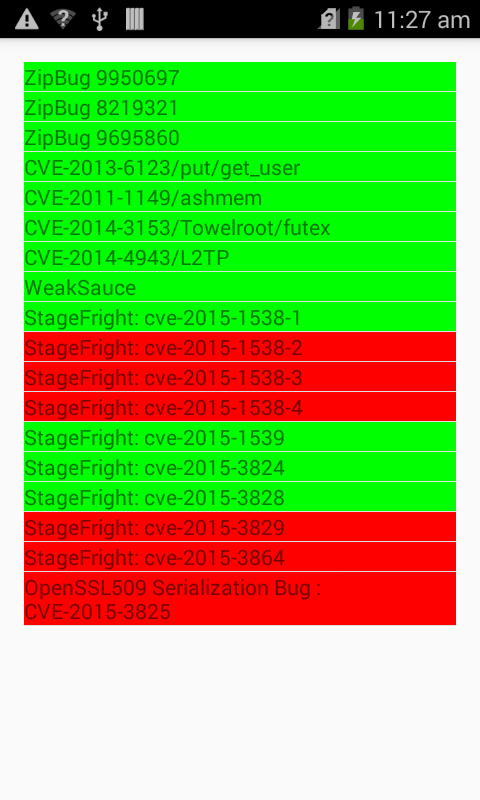

## Overview
This tool was meant to show the end user the attack surface that a given device is susceptible to.  In implementing these checks we attempt to minimize or eliminate both false positives/false negatives without negatively affecting system stability.

## Rationale for necessity
When a vulnerability is discovered, Google receives word and applies a patch to Android.  The Nexus devices are usually the devices that receive these patches quickest as they deviate the least (read: not at all) from AOSP (Android Open Source Project - The core of Android, where Google commits to).  The lag time between learning about a bug and the time when a patch is applied to a device can still be significant (for OEMs, it can be > 1 year or never).  For example, the futex bug (CVE-2014-3153/Towelroot) was known about in late May, early June.  This bug is still not patched on my latest Nexus 5 (Android 4.4.4).  This leaves users extremely vulnerable to attack from applications.  Users mostly do not know that their devices are vulnerable and this tool is meant to give visibility into the vulnerabilities a given device is susceptible to.

## Lifecycle of a patch
Samsung, HTC, and every other OEM keep heavily customized versions of Android.  The patch deployment infrastructure from OEMS -> carriers -> users is in disarray.  The OEMs receive the patches from Google and spend weeks or months applying these to some devices and testing. Then they ship off the device updates to the carrier who is responsible for pushing them to the end user.  They then go through another QA cycle from the carrier.

## Implementation
Vulnerabilities in a device can exist at many layers inside of Android. For example, a bug can exist in the kernel (Towelroot, for example) or it can exist in the Android specific framework (Android Masterkeys/FakeID).  Some of the kernel bugs can sometimes be difficult to check for without potentially causing system instability.  This implementation takes care to not include checks that could cause instability problems for the end user and therefore may omit checks that could cause these types of issues.  The framework is very thin at the current time and consists of a vector of vulnerability checks.  Their concrete implementations vary wildly depending on the bug.

A list of current bug checks:
  - [ZipBug9950697](https://github.com/Fuzion24/AndroidZipArbitrage#android-bug-9950697)
  - [Zip Bug 8219321  / Master keys](https://github.com/Fuzion24/AndroidZipArbitrage#android-bug-8219321-aka-android-master-keys)
  - [Zip Bug 9695860](https://github.com/Fuzion24/AndroidZipArbitrage#android-bug-9695860)
  - [Jar Bug 13678484 / Android FakeID](https://bluebox.com/technical/android-fake-id-vulnerability/)
  - [CVE 2013-6282 / put/get_user](https://www.codeaurora.org/projects/security-advisories/missing-access-checks-putusergetuser-kernel-api-cve-2013-6282)
  - [CVE_2011_1149 / PSNueter / Ashmem Exploit](http://www.cvedetails.com/cve/CVE-2011-1149/)
  - [CVE_2014_3153 / Futex bug / Towelroot] (http://seclists.org/oss-sec/2014/q2/467)
  - [CVE 2014-3847 / WeakSauce](http://forum.xda-developers.com/showthread.php?t=2699089)
  - [StumpRoot](http://forum.xda-developers.com/lg-g3/orig-development/root-stump-root-lg-g3-sprint-verizon-t2850906)

## Previous work
There have been attempts before to solve this issue. [xray.io](http://www.xray.io/)  Xray works by actually attempting the exploit which doesn't satisfy our system stability constraint. There also exist other applications which attempt to determine a devices attack surface by simply using a lookup based on Android verison/build information.  This causes both false negatives and false positives.  Imagine the case where an OEM has back ported a fix to a device, but the check solely relies on an Android device; false positive.  The case where an OEM upgrades to an Android version/kernel version which includes patches, but manages to break them causes the case of a false negative.

